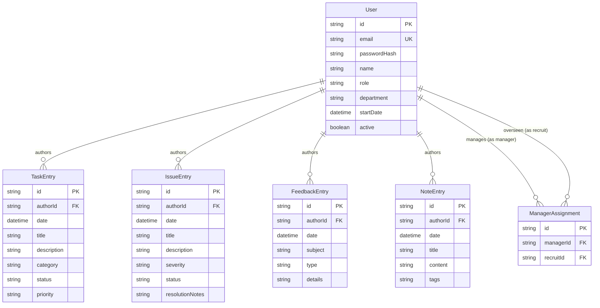
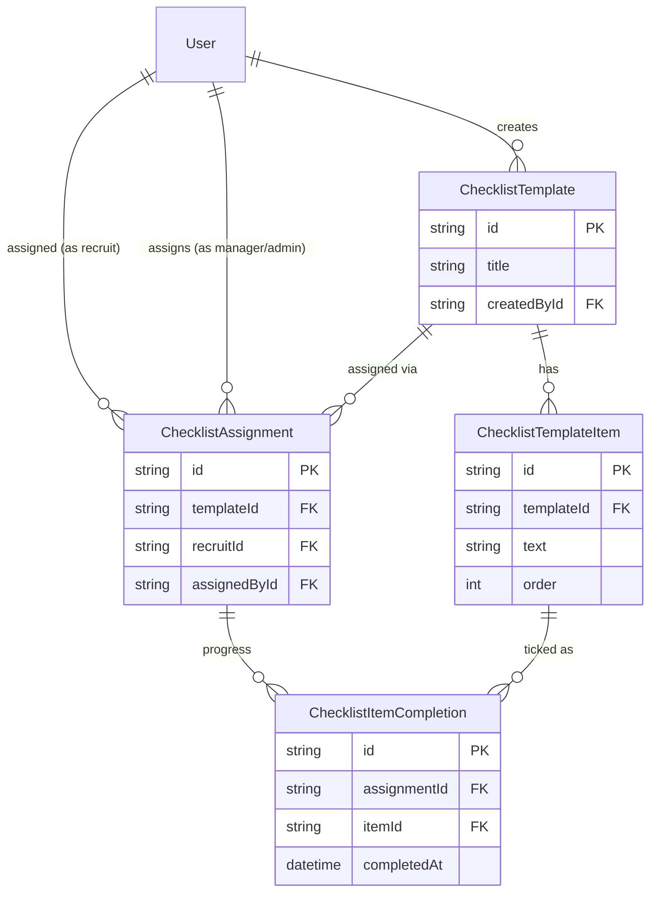

# Onboarding Diary — Data Model

Prisma + SQLite (Postgres-ready: no SQLite-only features; enums modeled as string fields with app-level validation since SQLite lacks native enums — swap to Prisma enums when moving to Postgres).

## Entities

### User

| Field | Type | Constraints |
|---|---|---|
| id | String (cuid) | PK |
| email | String | unique, lowercase |
| passwordHash | String | bcrypt(12); never serialized |
| name | String | 1–100 |
| role | String | `RECRUIT` \| `MANAGER` \| `ADMIN` (default RECRUIT) |
| department | String? | ≤100 |
| startDate | DateTime? | date-only semantics |
| active | Boolean | default true; false blocks login |
| createdAt / updatedAt | DateTime | auto |

### ManagerAssignment (manager → recruit oversight)

Join table giving a manager read access to a recruit's entries and enabling scoped reports/dashboards.

| Field | Type | Constraints |
|---|---|---|
| id | String (cuid) | PK |
| managerId | String | FK → User.id (role MANAGER) |
| recruitId | String | FK → User.id (role RECRUIT) |
| createdAt | DateTime | auto |

Constraints: `@@unique([managerId, recruitId])`; role validity enforced at app layer. A recruit may have multiple managers and vice versa (many-to-many), though the demo default is one manager per recruit.

### TaskEntry

| Field | Type | Constraints |
|---|---|---|
| id | String (cuid) | PK |
| authorId | String | FK → User.id, indexed |
| date | DateTime | required (date-only) |
| title | String | 1–200 |
| description | String? | ≤5000 |
| category | String | GENERAL \| TRAINING \| SETUP \| MEETING \| DOCUMENTATION \| OTHER |
| status | String | TODO \| IN_PROGRESS \| DONE \| BLOCKED (default TODO) |
| priority | String | LOW \| MEDIUM \| HIGH (default MEDIUM) |
| createdAt / updatedAt | DateTime | auto |

### IssueEntry

| Field | Type | Constraints |
|---|---|---|
| id | String (cuid) | PK |
| authorId | String | FK → User.id, indexed |
| date | DateTime | required |
| title | String | 1–200 |
| description | String? | ≤5000 |
| severity | String | LOW \| MEDIUM \| HIGH \| CRITICAL |
| status | String | OPEN \| IN_PROGRESS \| RESOLVED (default OPEN) |
| resolutionNotes | String? | ≤5000 |
| createdAt / updatedAt | DateTime | auto |

### FeedbackEntry

| Field | Type | Constraints |
|---|---|---|
| id | String (cuid) | PK |
| authorId | String | FK → User.id, indexed |
| date | DateTime | required |
| subject | String | 1–200 |
| type | String | POSITIVE \| SUGGESTION \| CONCERN |
| details | String | 1–5000 |
| createdAt / updatedAt | DateTime | auto |

### NoteEntry

| Field | Type | Constraints |
|---|---|---|
| id | String (cuid) | PK |
| authorId | String | FK → User.id, indexed |
| date | DateTime | required |
| title | String | 1–200 |
| content | String | 1–5000 |
| tags | String | comma-separated, ≤10 tags × ≤30 chars; exposed as array in API |
| createdAt / updatedAt | DateTime | auto |

## Relations

- User 1—N TaskEntry / IssueEntry / FeedbackEntry / NoteEntry (via `authorId`, cascade delete with user).
- User (manager) N—M User (recruit) via ManagerAssignment — the oversight relation used to scope manager dashboards and reports.

## Indexes

- `User.email` unique
- `ManagerAssignment(managerId, recruitId)` unique; index on each FK
- All entry tables: index on `authorId`, composite `(authorId, date)` for date-range filters/reports

## ERD

## Extensions — Checklists

Templates/items are kept separate from assignments/completions: a template is a reusable definition; assigning it to a recruit creates a `ChecklistAssignment`, and each ticked item is a `ChecklistItemCompletion` row (progress is derived, never stored).

### ChecklistTemplate

| Field | Type | Constraints |
|---|---|---|
| id | String (cuid) | PK |
| title | String | 1–200 |
| createdById | String | FK → User.id (role MANAGER/ADMIN, app-enforced) |
| createdAt / updatedAt | DateTime | auto |

### ChecklistTemplateItem

| Field | Type | Constraints |
|---|---|---|
| id | String (cuid) | PK |
| templateId | String | FK → ChecklistTemplate.id (cascade) |
| text | String | 1–500 |
| order | Int | 1-based position; `@@unique([templateId, order])` |

### ChecklistAssignment

| Field | Type | Constraints |
|---|---|---|
| id | String (cuid) | PK |
| templateId | String | FK → ChecklistTemplate.id (cascade) |
| recruitId | String | FK → User.id (role RECRUIT, app-enforced) |
| assignedById | String | FK → User.id (manager/admin) |
| createdAt | DateTime | auto |

Constraints: `@@unique([templateId, recruitId])` — a template is assigned to a recruit at most once.

### ChecklistItemCompletion

| Field | Type | Constraints |
|---|---|---|
| id | String (cuid) | PK |
| assignmentId | String | FK → ChecklistAssignment.id (cascade) |
| itemId | String | FK → ChecklistTemplateItem.id (cascade) |
| completedAt | DateTime | auto |

Constraints: `@@unique([assignmentId, itemId])` — an item is completed at most once per assignment; unticking deletes the row.

### Relations & indexes

- ChecklistTemplate 1—N ChecklistTemplateItem; 1—N ChecklistAssignment (both cascade on template delete).
- ChecklistAssignment 1—N ChecklistItemCompletion (cascade on assignment delete); deleting a template item cascades its completions.
- User 1—N ChecklistTemplate (creator), 1—N ChecklistAssignment (as recruit and as assigner); all cascade with the user.
- Indexes: `ChecklistTemplate.createdById`; `ChecklistTemplateItem.templateId`; `ChecklistAssignment.recruitId`, `.templateId`; `ChecklistItemCompletion.assignmentId`.

