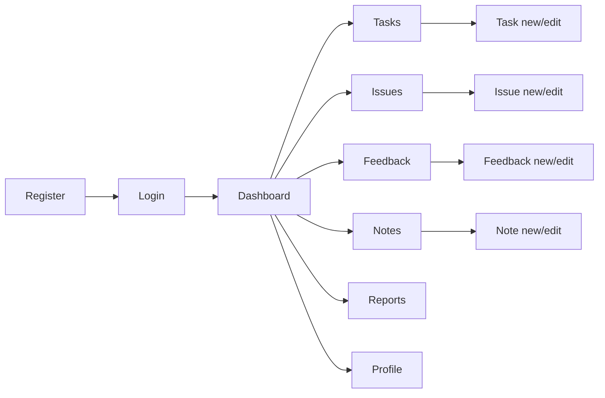
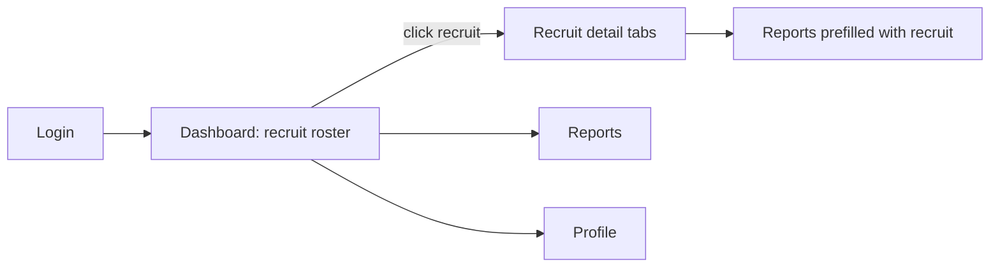
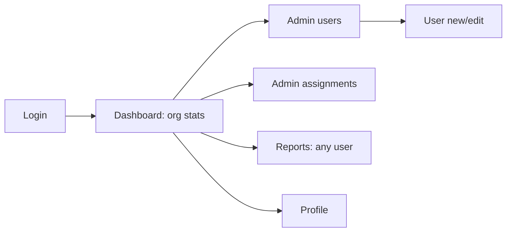

# Onboarding Diary — UI Flows

## Screen inventory

| # | Screen | Route | Roles | Purpose |
|---|---|---|---|---|
| 1 | Login | /login | public | Email + password sign-in |
| 2 | Register | /register | public | Recruit self-signup |
| 3 | Dashboard | /dashboard | all | Role-specific summary (counts, progress, recent entries / roster / org stats) |
| 4 | Task list | /tasks | recruit (mgr/admin read-only via /users/:id/tasks) | List + filters (date range, category, status) |
| 5 | Task form | /tasks/new, /tasks/:id/edit | recruit | Create/edit task |
| 6 | Issue list | /issues (+scoped) | recruit, mgr/admin read | List + filters (status, severity) |
| 7 | Issue form | /issues/new, /issues/:id/edit | recruit | Create/edit issue, resolution notes |
| 8 | Feedback list | /feedback (+scoped) | recruit, mgr/admin read | List + type filter |
| 9 | Feedback form | /feedback/new, /feedback/:id/edit | recruit | Submit/edit feedback |
| 10 | Notes list | /notes (+scoped) | recruit, mgr/admin read | List + tag filter |
| 11 | Note form | /notes/new, /notes/:id/edit | recruit | Create/edit note |
| 12 | Recruit detail | /recruits/:id | manager, admin | Read-only tabs over a recruit's tasks/issues/feedback/notes |
| 13 | Reports | /reports | all | Date range + type + format picker; manager/admin also pick user; download PDF/CSV |
| 14 | Profile | /profile | all | View/edit own profile, change password |
| 15 | Admin users | /admin/users (+ /new, /:id/edit) | admin | User CRUD, role, activate/deactivate, password reset |
| 16 | Admin assignments | /admin/assignments | admin | Manage manager↔recruit assignments |

Global layout: authenticated pages share an app shell with sidebar navigation (role-filtered items), header with user menu (profile, logout).

## Navigation flows

### Recruit

- Post-login lands on Dashboard; quick-add buttons on Dashboard deep-link to each "new" form.
- Lists support filter bars; row click opens edit; delete via confirm dialog.
- Reports: pick range + types + format → file downloads in place.

### Manager

- Roster rows show completion %, open issues, last activity; clicking opens read-only Recruit detail (no edit/delete controls rendered).
- Reports screen includes a recruit selector limited to assigned recruits.

### Admin

## States

- **Loading**: skeleton rows on lists, spinner on submit buttons (disabled while pending).
- **Empty**: each list shows an empty state with a "create your first…" CTA (recruit) or explanatory text (manager/admin).
- **Errors**: inline field errors from validation; toast for server errors; 403/404 pages with a link back to Dashboard.
- **Unauthenticated** access to protected route → redirect to /login with return URL; wrong-role access → 403 page.

## Responsive behavior

| Breakpoint | Behavior |
|---|---|
| ≥1024px (lg) | Persistent sidebar; tables with full columns; forms two-column |
| 640–1023px (sm–md) | Collapsible sidebar (hamburger); tables hide secondary columns |
| <640px | Sidebar becomes slide-over drawer; tables render as stacked cards (title, key badges, date); filter bars collapse into a "Filters" disclosure; forms single-column; sticky bottom action bar on forms |

- Touch targets ≥44px; dialogs full-screen on mobile.
- Dashboard cards wrap 4→2→1 columns; charts (Step 3) resize fluidly via recharts ResponsiveContainer.
- Report download works identically on mobile (browser download).
